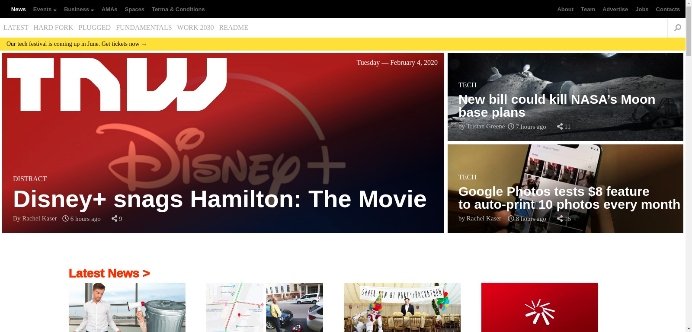

# Project Name

> The Next Web Clone

This Is a Clone of The Next Web website

## Built With

- HTML
- CSS

## Live Demo

[Live Demo Link](https://rawcdn.githack.com/Eshy10/The-Next-Web-Clone/1385f4511b9b8f45ba33961c8883e232d37086c9/index.html)

### Usage

- open index.html file

## Authors

👤 **SpaYco**

- Github: [@SpaYco](https://github.com/SpaYco)
- Twitter: [@iSpaYco](https://twitter.com/iSpaYco)
- Linkedin: [Aziz Mejri](https://www.linkedin.com/in/spayco/)

👤 **Supersebek**

- Github: [@Eshy10](https://github.com/Eshy10)
- Twitter: [@AdesholaAdewal6](https://twitter.com/AdesholaAdewal6)
- Linkedin: [Adeshola Adewale ](https://www.linkedin.com/in/adewale-adeshola-b0b581139/ )

## 🤝 Contributing

Contributions, issues and feature requests are welcome!

Feel free to check the [issues page](issues/).

## Show your support

Give a ⭐️ if you like this project!
## 📝 License

This project is [MIT](LICENSE) licensed.
